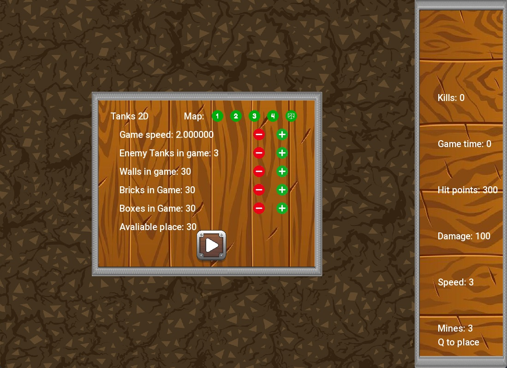
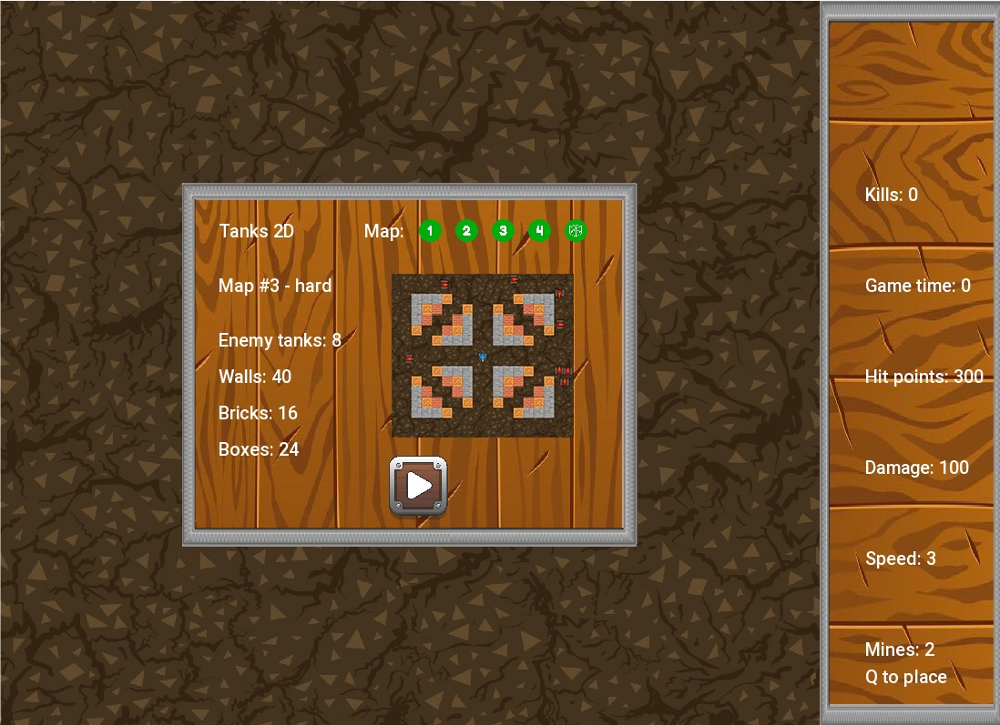
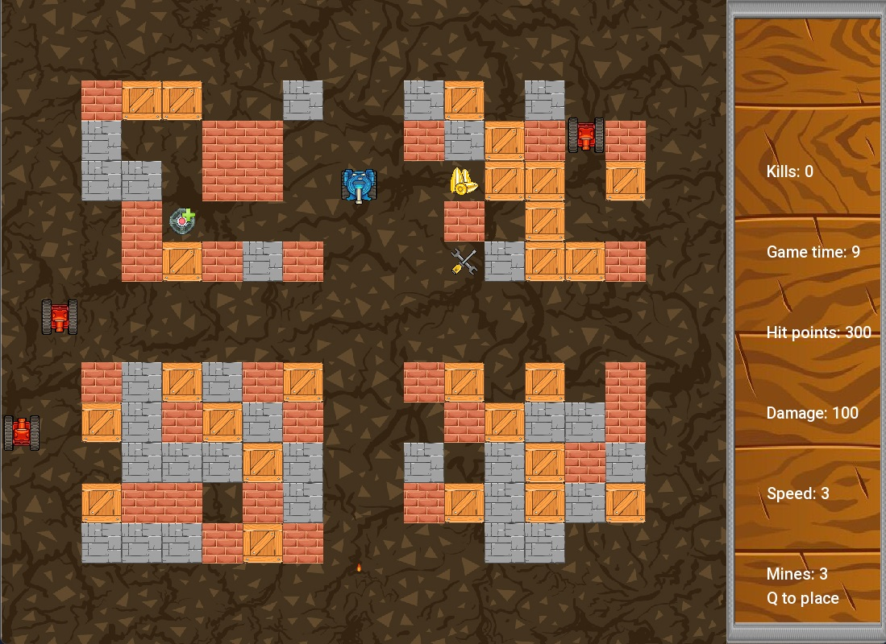

# Tanks 2D

## About the project

Tanks 2D is an OOP project written in cpp with sfml library. The game consists of a tank battle on a selected or randomly generated map, the player controls his own vehicle and his goal is to survive as long as possible on the battlefield and destroy as many opponents as possible. Thus achieving the highest number of points at the end of the summary. The game also contains various bonuses hidden in boxes, for example: bonus to HP, damage, tank speed or mines. Control is done with arrows or WASD, and pressing the Q button places a mine that destroys the enemy.

## Build with

## Main window

which allows you to set the map or generate your own, the number of opponents and their speed

## Game

## How to run

1. Clone the repo
   `git clone https://github.com/JudiJudi6/Tanks-2D.git`

2. Just simply run in your environment and compile.